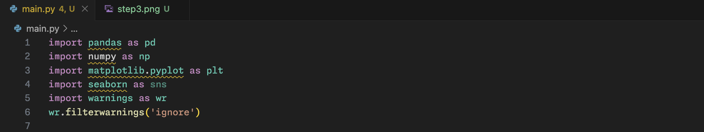
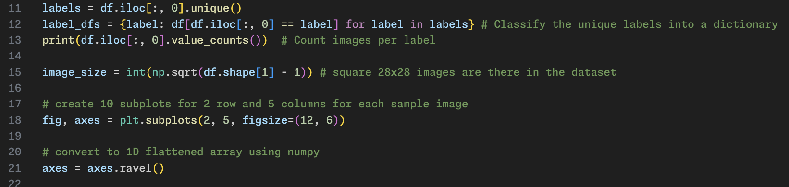
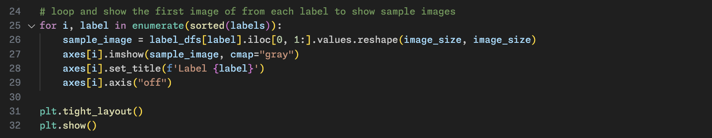
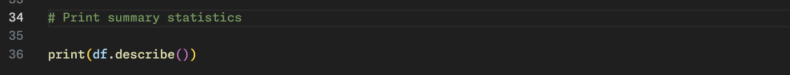
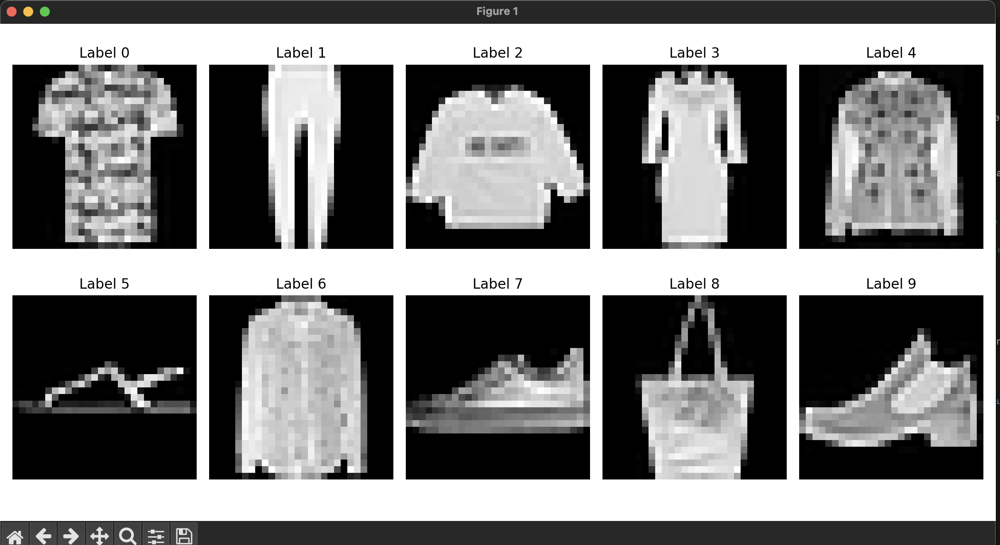
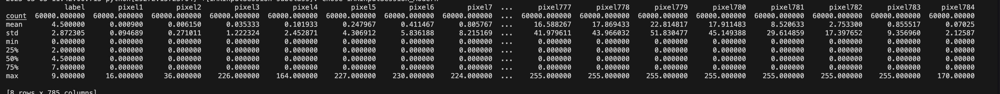

### AI-ML-Task-Image-Classification-Challenge:

#### Level - 1: Exploratory Data Analysis

> Dataset is not present is in this repository as it was too large to upload to github.

##### Steps: 

- Step - 1: Creating main.py file and importing the required libraries (pandas, numpy and matplotlib).

- Step - 2: Reading the csv data file using pandas and storing it in a dataframe

- Step - 3: Using the dataframe classify the images based on their labels into a dictionary. Create subplots for displaying the images.

- Step - 4: Display the sample images (first) from each particular label category to understand the data distribution.

- Step - 5: Print the summary statistics of the given datset and store them in a csv file.

##### Plot displaying sample images:

##### Summary/Statistics of the dataset:

