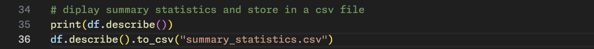
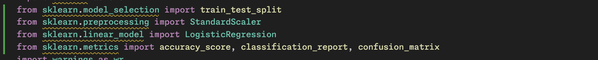

### AI-ML-Task-Image-Classification-Challenge:

#### Level - 1: Exploratory Data Analysis

> Dataset is not present in this repository as it was too large to upload to github.

##### Steps: 

- Step - 1: Creating main.py file and importing the required libraries (pandas, numpy and matplotlib).

- Step - 2: Reading the csv data file using pandas and storing it in a dataframe

- Step - 3: Using the dataframe classify the images based on their labels into a dictionary. Create subplots for displaying the images.

- Step - 4: Display the sample images (first) from each particular label category to understand the data distribution.

- Step - 5: Print the summary statistics of the given datset and store them in a csv file.

##### Plot displaying sample images:

##### Summary/Statistics of the dataset:

#### Level - 1: Logistic Regression Classification Model

##### Steps: 

- Step 1: Import required libraries like: 'sklearn' for logistic regression model, accuracy prediction and classification report, 'joblib' to store logistic regression model for future usage and 'os' to check whether the model is present or not.

- Step 2: We take the pixel values as the input values 'x' and the labels as output values 'y'. Split the dataset into two parts - 80% for training and 20% for testing.
Finally, standardize the pixel data (input values) to have mean 0 and standard deviation 1 which helps the logistic regression model to converge faster.

- Step 3: Check if the model is already present in the present working directory using 'os' library in python. If it is already present use the 'joblib' library to load the pickle file. If it's not present make the logistic regression model using 'sklearn' and train it on the training values. Finally, dump the model into a file using 'joblib' library for future usage.

- Step 4: Use the model now to predict the set labels and get the model accuracy score, the classification report and get the confusion matrix as heatmap using 'seaborn' library and plot it using matplotlib.

##### Model Accuracy Score and Classification Report:

##### Confusion Matrix Heatmap:

##### Classifying random images from the test set:

